# Architecture

Policy Time Machine is a Databricks-native system deployed as one Asset Bundle. This document describes how the parts fit together. The specifications in [`specs/`](./specs/README.md) define each part in detail, and the decision records in [`adr/`](./adr) explain why it is shaped this way.

## The system in one picture



Other views: [Genie space entity model](./diagrams/rendered/02-er-genie-space.svg), [investigation loop](./diagrams/rendered/03-investigation-loop.svg), [deployment](./diagrams/rendered/04-deployment.svg), [data pipeline](./diagrams/rendered/05-data-pipeline.svg), [source-layer entity model](./diagrams/rendered/06-er-raw-layer.svg).

## Design principles

1. **Relationships are data; thresholds are questions.** The pipeline computes every temporal relationship once, as a verified column. Genie only filters and groups. A new question *shape* is a pipeline change, which is a deliberate trade: an opinionated semantic layer that can be tested beats a flexible one that cannot ([ADR-0002](./adr/0002-genie-sees-four-flat-tables-with-precomputed-relationships.md)).
2. **Definitions, not judgement.** Material change, high-severity, recent, similar and noteworthy each have one deterministic definition, enforced in the pipeline and stated to Genie verbatim ([ADR-0003](./adr/0003-materiality-is-a-fixed-category-set.md), [ADR-0008](./adr/0008-severity-bands-are-fixed-with-limit-utilisation-as-a-second-axis.md), [ADR-0009](./adr/0009-noteworthy-patterns-are-named-rules-stored-twice.md)).
3. **Invariants are enforced at write time.** Twenty pipeline expectations fail the run rather than let a plausible-but-wrong row through ([ADR-0013](./adr/0013-invariants-are-enforced-as-pipeline-expectations.md)).
4. **Unity Catalog is the access-control point for policy data.** The app holds no authorization logic of its own for the gold tables.
5. **The nondeterministic layers are tested against ground truth.** Genie and the review agent are asserted on their results, never on their SQL or prose ([ADR-0015](./adr/0015-genie-is-tested-against-planted-ground-truth.md)).

## Data layer

Three Unity Catalog schemas follow the medallion convention ([ADR-0016](./adr/0016-the-catalog-follows-medallion-schemas.md)).

| Schema | Contents | Who reads it |
|---|---|---|
| `ptm_bronze` | Nine source tables: SCD Type 2 policy and coverage history, claims and claim payments, vehicles, customers, agents, and the generator's manifest and scenario assignments | The pipeline, the `route_claims` task (the manifest's anchor date) and the verification suites |
| `ptm_silver` | `change_event`, the conformed change stream diffed from policy versions | The pipeline only |
| `ptm_gold` | Six curated tables. This schema *is* the Genie space | Genie, the app, the review agent |

The six gold tables ([spec 02](./specs/02-semantic-layer.md)):

| Table | Grain | Role |
|---|---|---|
| `policy_change_event` | One policy change | Carries the claim linkage columns: `next_claim_id`, `days_to_next_claim_loss`, `change_timing` |
| `claim_event` | One claim | Severity band, limit utilisation, prior-change context anchored on loss date |
| `policy_profile` | One policy | Current state, behavioural summary, pattern flags |
| `policy_timeline_event` | One dated event | The deterministic source for the timeline view |
| `policy_pattern_match` | One policy-and-pattern match | Named rules that fired, with the evidence for each |
| `policy_similarity` | One policy-and-neighbour pair | Twenty nearest neighbours by behaviour, with reasons ([ADR-0010](./adr/0010-similar-history-is-a-precomputed-neighbour-table.md)) |

The pipeline is a serverless Lakeflow Declarative Pipeline. Transformation logic lives in `pipeline/transformations.py` as plain functions with no Spark dependency, so the whole rule set is unit-tested on a laptop. `pipeline/dlt_pipeline.py` only reads, calls those builders, and attaches the expectations from `pipeline/expectations.py`.

### The reference dataset

`generator/` produces a seeded, anchor-parameterised dataset of 8,000 personal auto policies. The seed owns identities and stories. The anchor date owns calendar dates, so a regeneration tells identical stories at shifted dates ([ADR-0006](./adr/0006-dataset-is-anchored-to-generation-date.md)). It plants six scenario populations and five control populations at declared effect sizes ([ADR-0014](./adr/0014-the-planted-signal-is-modest-heterogeneous-and-declared.md)).

The planted scenarios are what make the system testable end to end: they are the ground truth that Genie's answers and the agent's Briefs are asserted against. The reference dataset therefore stays in every environment's test path even after a real source is connected. See [`roadmap.md`](./roadmap.md) for source onboarding.

## Genie space

The space is authored as code in `genie/build_space.py` and rendered to `instructions.md`, `examples.sql` and `functions.sql` for review. It attaches exactly the six gold tables, the approved vocabulary, an example SQL library, and two trusted SQL functions. Unity Catalog table and column comments are authored once in `pipeline/uc_comments.py` and are part of the semantic layer, because Genie reads them. [`genie-curation.md`](./genie-curation.md) records how the space measures against Databricks' curation guidance.

## Application

A Databricks App: a FastAPI backend serving a built React frontend ([ADR-0012](./adr/0012-the-app-runs-on-databricks-apps-as-fastapi-plus-react.md)).

| Route | Served by | Depends on Genie |
|---|---|---|
| `POST /api/investigations`, `POST /api/investigations/{id}/messages` | Genie Conversation API proxy. One investigation tab is one Genie conversation ([ADR-0011](./adr/0011-investigations-are-multi-turn-genie-conversations-with-authored-chips.md)) | Yes |
| `GET /api/policies/{id}/timeline`, `/similar`, `/patterns` | The app's own deterministic SQL against the warehouse | No |
| `GET /api/chips` | The authored follow-up question bank | No |
| `GET /api/review/queue`, `/claims/{id}`, `/runs/{id}`; `POST /api/review/claims/{id}/brief`, `/disposition` | The review record in Lakebase and the agent runner | Only while a Run executes |
| `GET /api/health` | Liveness | No |

The timeline is independent of Genie by design. It renders when Genie fails, times out, or returns nothing ([ADR-0007](./adr/0007-generic-rendering-with-input-side-policy-detection.md)).

## Identity and access

The app uses on-behalf-of-user authorization. Databricks Apps forwards the viewer's downscoped OAuth token, and the backend builds its SDK client from it, so every Genie call, evidence re-run and deterministic query a person makes while investigating executes **as the viewer**. The declared user scopes are `dashboards.genie` and `sql`.

Three identities do work in the system:

| Identity | What runs under it | Unity Catalog reach |
|---|---|---|
| The viewer | Investigations, evidence re-runs, timelines, and the access check before a Brief is served | Whatever the person is granted. For analysts, `ptm_gold` only |
| The app's service principal | Review Runs requested from the app (their Genie and warehouse calls), and every read and write of the Lakebase review record | `ptm_gold` only |
| The regeneration job's run-as identity | The generator load, the pipeline refresh, `route_claims`, and the nightly Runs in `build_briefs` | Broader: it writes `ptm_bronze` and reads the generation manifest there |

Consequences:

- A Unity Catalog grant on `ptm_gold` is what gives a person access. Revoking it silences every path in the app together, and the UI shows one consistent no-access state.
- The review record is the exception to platform enforcement. Briefs and Dispositions live in Lakebase, which the app's service principal owns, and Runs do not execute as the viewer. Before serving a Brief, the app checks the viewer's warehouse access to the gold tables and mirrors the answer. This is a gate in the app, not enforcement in the platform, and [ADR-0019](./adr/0019-the-review-record-is-app-owned-and-mirrors-unity-catalog.md) says so plainly.
- The app's identity cannot read bronze, so `route_claims` copies the one bronze fact a Run needs, the dataset anchor date, into the review record.

## Claim Review Brief agent

Code: `app/backend/review/`. Decisions: [ADR-0017](./adr/0017-agent-runs-on-a-disposable-lakebase-branch.md), [ADR-0018](./adr/0018-the-harness-owns-the-plan-the-model-owns-the-question.md), [ADR-0019](./adr/0019-the-review-record-is-app-owned-and-mirrors-unity-catalog.md).

- **Routing.** One deterministic Routing Rule places claims in the review queue: a High-Severity Claim whose Report Date is Recent. A reviewer can also request a Brief for any claim from its timeline card.
- **The harness owns the plan; the model owns the question.** The plan is fixed: claim, branch, sequence, relevant changes, question, Genie, similar histories, sentences, promote, delete branch. The model is consulted at exactly three points: choosing the question to ask Genie, an optional follow-up, and writing the sentences. It never touches the plan or the branch lifecycle.
- **Every Run works on a disposable Lakebase Working Branch.** The harness stages the timeline, Genie result and neighbour rows there as tables, and the model queries across them with a budgeted, read-only scratch SQL tool. Model-written SQL is acceptable because the blast radius is a copy-on-write fork that is deleted when the Run ends. Only a complete Brief and a compact run record are copied to the main branch. A failed Run promotes nothing.
- **The Brief restates facts and never weighs them.** Every sentence passes the vocabulary check or is withheld, with the reason shown to the reviewer. The weighing is the reviewer's Disposition, which the agent never proposes.
- **MLflow tracing is the durable audit record** of what the agent did, since the step log dies with the branch.

The review database holds `routed_claim`, `run`, `brief`, `disposition`, `investigation` and `dataset`, the last carrying the dataset anchor date. Model calls go through Databricks Model Serving, to the endpoint named by `REVIEW_MODEL_ENDPOINT`.

## Orchestration

One Workflows job, `policy_time_machine_regeneration`, runs daily:

```
generate → validate → load_source_tables → refresh_pipeline → route_claims → build_briefs
```

`validate` fails the job if realised effect sizes drift from their declared parameters. `build_briefs` runs the agent over newly routed claims, sequentially, capped per night by `REVIEW_NIGHTLY_CAP`. See [`operations.md`](./operations.md).

## Verification

Five layers, each naming a failure mode where the system would otherwise return something plausible rather than something broken ([spec 08](./specs/08-test-strategy.md)).

| Layer | Where | Needs a workspace |
|---|---|---|
| Pipeline expectations | `pipeline/expectations.py`, enforced on every pipeline run | Yes |
| Generator validation | `generator/validate.py`, run in the job | No |
| Chip execution | `ci/genie/run_chips.py` | Yes |
| Query contracts | `ci/genie/run_contracts.py`, fifteen contracts at three of three | Yes |
| Review agent | Harness and view unit tests, `ci/review/smoke_branch.py`, `ci/review/run_brief_contract.py` | Unit tests no; live checks yes |
