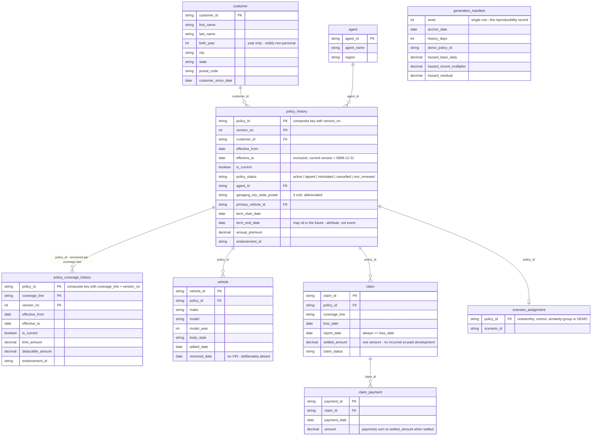

# Data Model and Synthetic Data Specification

Source data model and the generator that produces it. Everything here is synthetic; no real data and no PII are involved at any point. Decisions referenced as ADR-000N live in `docs/adr/`.

Read `CONTEXT.md` first — this document uses its vocabulary precisely.

How the data flows, from seed to Genie-ready (source: [`docs/diagrams/05-data-pipeline.mmd`](../diagrams/05-data-pipeline.mmd)):

```mermaid
%% Diagram 5 — Data pipeline and lineage. Audience: data model + synthetic data spec.
%% Embedded in docs/specs/01-data-model-and-synthetic-data.md.
flowchart LR
    sched["Workflows schedule<br/>(regeneration)"]
    seed["seed + anchor_date"]
    gen["Generator<br/>IDs from seed only · dates from anchor+offset ·<br/>deterministic scenarios + control populations ·<br/>declared effect sizes"]
    raw["raw SCD2 policy_history<br/>+ raw claims<br/>(outside the Genie space)"]
    dlt["DLT with expectations —<br/>no sentinels · linkage columns NULL together ·<br/>severity bands partition · days_to_next_claim_report >= 0 ·<br/>similarity excludes self"]
    subgraph gspace["Genie space — 6 curated tables"]
        pce["policy_change_event"]
        ce["claim_event"]
        pp["policy_profile"]
        pte["policy_timeline_event"]
        ppm["policy_pattern_match"]
        ps["policy_similarity"]
    end
    val["post-generation validation job —<br/>measured effect sizes within tolerance of declared;<br/>category ranking matches declaration"]
    ready(["Genie space ready"])

    seed --> gen
    sched -.->|"scheduled regeneration"| gen
    gen --> raw --> dlt --> gspace --> val --> ready
```

---

## 1. Scope

Personal auto only (ADR-0005). Coverage is modelled as named Coverage Lines, each with its own limit and, where applicable, its own deductible.

**Coverage lines**

| Line | Code | Has deductible |
|---|---|---|
| Bodily injury liability | `BI` | no |
| Property damage liability | `PD` | no |
| Collision | `COLL` | yes |
| Comprehensive | `COMP` | yes |
| Uninsured/underinsured motorist | `UMUIM` | no |

A deductible change on `BI`, `PD` or `UMUIM` is not a valid row and the generator must never emit one.

---

## 2. Identifier contract

Identifiers are a contract between the generator and the application (ADR-0007), not an incidental format. The app detects policy references in question text with `\bP-\d{5}\b`, case-insensitive.

| Entity | Format | Example |
|---|---|---|
| Policy | `P-` + 5 digits | `P-18492` |
| Customer | `C-` + 6 digits | `C-004182` |
| Claim | `CLM-` + 6 digits | `CLM-002317` |
| Vehicle | `VEH-` + 6 digits | `VEH-009104` |
| Agent | `AGT-` + 4 digits | `AGT-0072` |
| Endorsement | `END-` + 8 digits | `END-00418302` |
| Change event | `CHG-` + 8 digits | `CHG-00931744` |

**Lexical reservation.** No identifier of any other type may contain a substring matching the policy pattern. The generator asserts this at emit time; a violation is a build failure, because it silently breaks timeline routing.

**Stability.** All identifiers derive from the seed alone (ADR-0006). `P-18492` is the same policy with the same story at every anchor date.

---

## 3. Source tables — the bronze layer

These are the raw layer, published to the `ptm_bronze` schema alongside the `raw` landing volume (medallion layout, ADR-0016). **None of them is exposed to Genie** (ADR-0002); the curated gold tables in `02-semantic-layer.md` are built from them, by way of the silver `change_event` stream (`ptm_silver`).

The bronze layer at a glance (source: [`docs/diagrams/06-er-raw-layer.mmd`](../diagrams/06-er-raw-layer.mmd)):

### `customer`
`customer_id`, `first_name`, `last_name`, `birth_year`, `city`, `state`, `postal_code`, `customer_since_date`

Names are drawn from a synthetic name pool. Birth *year* only, not full date of birth — there is no analytical need for the extra precision and it keeps the dataset visibly non-personal.

### `policy_history` — SCD Type 2, one row per policy version
`policy_id`, `version_no`, `customer_id`, `effective_from`, `effective_to`, `is_current`, `policy_status`, `agent_id`, `garaging_city`, `garaging_state`, `garaging_postal_code`, `primary_vehicle_id`, `term_start_date`, `term_end_date`, `annual_premium`, `endorsement_id`

`effective_to` is exclusive; the current version carries `9999-12-31`. Versions are contiguous and non-overlapping per policy.

`policy_status` ∈ `active`, `lapsed`, `reinstated`, `cancelled`, `non_renewed`.

### `policy_coverage_history` — SCD Type 2, one row per policy × coverage line × version
`policy_id`, `coverage_line`, `version_no`, `effective_from`, `effective_to`, `is_current`, `limit_amount`, `deductible_amount`, `endorsement_id`

Separate from `policy_history` because coverage changes on one line independently of the others. `deductible_amount` is NULL for `BI`, `PD`, `UMUIM`.

### `vehicle`
`vehicle_id`, `policy_id`, `make`, `model`, `model_year`, `body_style`, `added_date`, `removed_date`

`vin` is deliberately absent — it carries no analytical value and inventing VIN-shaped strings invites confusion about whether the data is real.

### `agent`
`agent_id`, `agent_name`, `region`

### `claim`
`claim_id`, `policy_id`, `coverage_line`, `loss_date`, `report_date`, `settled_amount`, `claim_status`

One settled amount per claim; no incurred-versus-paid development (ADR-0008). `report_date >= loss_date` always.

### `claim_payment`
`payment_id`, `claim_id`, `payment_date`, `amount`

Present so payments can appear on the timeline. Payments sum to `settled_amount` for settled claims. Not used in any analytical measure.

---

## 4. Volumes

Assumed unless overridden. Sized so exact similarity computation stays trivial and warehouse queries stay sub-second.

| Entity | Target |
|---|---|
| History depth | 3 years before the anchor |
| Customers | ~6,500 |
| Policies | ~8,000 |
| Vehicles | ~9,500 |
| Policy versions | ~55,000 |
| Change events (all) | ~95,000 |
| Change events (material) | ~40,000 |
| Claims | ~5,500 |
| Claim payments | ~7,000 |

---

## 5. Temporal generation rules

All from ADR-0006.

1. The generator takes `anchor_date` (default: generation date) and `seed`. Every event date is `anchor_date - offset_days`. **No absolute date literal appears anywhere in the generator.**
2. **No event timestamp exceeds `anchor_date`.** Attribute dates may — `term_end_date` legitimately sits in the future. The generator distinguishes event timestamps from attribute dates; clamping attributes would make every policy look expired.
3. `anchor_date` is a DATE in UTC, and the SQL warehouse timezone is set to UTC to match. A mismatch shifts every "last 30 days" boundary for a demo run near midnight.
4. **Guaranteed activity tail.** Material changes and claims are present throughout `anchor - 120d` to `anchor`, sized so that recency questions return results even at the maximum assumed staleness. The assumed maximum staleness is a stated, tested number.
5. **Loss-to-report lag is a first-class distribution** — never zero, never uniform. Recommended: lognormal, median 4 days, 90th percentile 21 days, capped at 60. This distribution is load-bearing (ADR-0004), because it creates the gap window that scenario S3 exploits.

---

## 6. Change emission rules

From ADR-0003.

**Material categories (five):** `coverage`, `deductible`, `vehicle`, `address`, `status`.
**Tracked but never material:** `premium`, `agent`.
**Timeline-only, not a change at all:** `renewal`.

Rules the generator must obey:

1. **Premium moves are emitted as derived changes** whenever coverage changes, and carry `is_material = false`. A one-decision endorsement must never register as two material changes.
2. **Renewal-driven status recalculations are never emitted as change events.** This is the premium-echo problem re-entering through a side door.
3. **Lapse and reinstate sequences are deliberate scenarios only,** never random noise. They appear in both the noteworthy and control populations.
4. **`endorsement_id` groups changes committed together** (ADR-0003). It is a column, never a grain. The generator knows what it committed together, so this information is free.
5. **Coverage and deductible magnitudes are controlled by the generator,** which is the only reason "any change is material" is defensible without a threshold. Real data would force thresholds here.

---

## 7. Claim generation

1. Every claim is filed against exactly one Coverage Line.
2. `settled_amount` is drawn so that all four severity bands are populated with meaningful counts, including `catastrophic` (ADR-0008). The distribution is designed around the band cuts, not the other way round.
3. `limit_utilization_pct` = `settled_amount / applicable_limit`. Values above 100% are legitimate and must occur in the data; they are never clamped.
4. **Baseline annual claim frequency: 6.0%.** Declared here because a modest relative effect on an implausible base rate still reads as broken to an insurance-literate reader.

---

## 8. Declared effect sizes

From ADR-0014. These are **design parameters, not observations**, and they are validated in CI.

**Headline comparison** (material change within the prior 90 days versus none):

| Group | Annual claim frequency |
|---|---|
| Recent material change | 8.5% |
| No recent material change | 5.8% |

**Category ordering** — relative lift in claim likelihood within 60 days following a material change of each category. The *ordering* is the specification; it must be stable across regenerations, because MVP capability 3 is a ranking question and a uniform effect produces noise-ordered bars.

| Category | Declared lift |
|---|---|
| Coverage increase | 1.80× |
| Deductible decrease | 1.50× |
| Vehicle change | 1.25× |
| Status change | 1.15× |
| Address change | 1.05× |

**Validation.** A post-generation check in the regeneration Workflow asserts that measured effects fall within ±15% relative of the declared values *and* that the category ranking matches the declared ordering exactly. Failure fails the build. Without this, a regeneration could silently invert the demo's portfolio chart.

---

## 9. Scenario catalogue

Deterministic, seed-assigned, placed at **relative offsets from the anchor** so the demo script survives regeneration. Each scenario names a fixed set of policies.

### Noteworthy scenarios

| ID | Name | Construction | Policies |
|---|---|---|---|
| S1 | Coverage raised, same line claimed | `COLL` limit raised at anchor−41d; collision claim, loss at anchor−17d, severity `severe` | 40 |
| S2 | Deductible lowered before claim | `COMP` deductible cut at anchor−52d; comprehensive claim at anchor−20d | 30 |
| S3 | Change inside the loss-to-report gap | Loss at anchor−34d, reported anchor−19d, address change at anchor−28d | 25 |
| S4 | Rapid change cluster | Four material changes across 22 days ending anchor−60d; claim at anchor−31d | 30 |
| S5 | Vehicle and address together | Vehicle change anchor−73d, address change anchor−48d | 35 |
| S6 | Claim near a newly raised limit | `COLL` limit raised anchor−66d; claim at 97% of the new limit, `moderate` band | 25 |

S6 exists specifically to exercise the two-axis conjunction from ADR-0008 — modest dollars, near-limit utilisation — which is the product's signature finding.

### Control populations

These are load-bearing, not decorative (ADR-0014). They are what make "modest signal" true rather than asserted.

| ID | Name | Purpose | Policies |
|---|---|---|---|
| C1 | High-value claim, no preceding change | Claims happen without changes | 60 |
| C2 | Frequently changed, never claimed | Changes do not imply claims | 80 |
| C3 | Benign gap-window change | An innocuous address change during the gap on a small claim | 40 |
| C4 | Near-limit claim, no preceding change | High utilisation is not itself a finding | 30 |
| C5 | Benign pattern match | Matches a pattern rule with a mundane explanation | 40 |

### Similarity groups

Scenario policies must be each other's nearest neighbours at known ranks, so the similarity demo moment is scripted-stable (ADR-0010). At least one control policy must have benign top neighbours, so that similarity itself does not read as an accusation.

### Demo anchor policy

One policy — conventionally the S1 exemplar — is the demo's primary subject and must have a rich, legible timeline: an address change, a coverage increase on `COLL`, a vehicle change, and a collision claim, in that order, all within the 60 days before the loss.

---

## 10. Determinism obligations

1. Identifiers, scenario assignment and population membership derive from the **seed alone**.
2. All dates derive from **anchor plus offset**.
3. Regeneration with the same seed and a different anchor produces the same stories at different dates.
4. The demo script uses relative language ("nineteen days before the claim") or is regenerated from the dataset. Absolute dates in any narrative document are illustration, never script.

---

## 11. Vocabulary constraint

Any generator-authored string that can reach a user — `pattern_name`, `top_reasons`, event display labels — draws only on the approved vocabulary list in `03-genie-knowledge.md`. Noteworthy, unusual, pattern, investigation candidate, requires review. Never fraud, suspicious, or any assertion about a person. This is enforced as a pipeline expectation (ADR-0013), not as a code-review convention.
