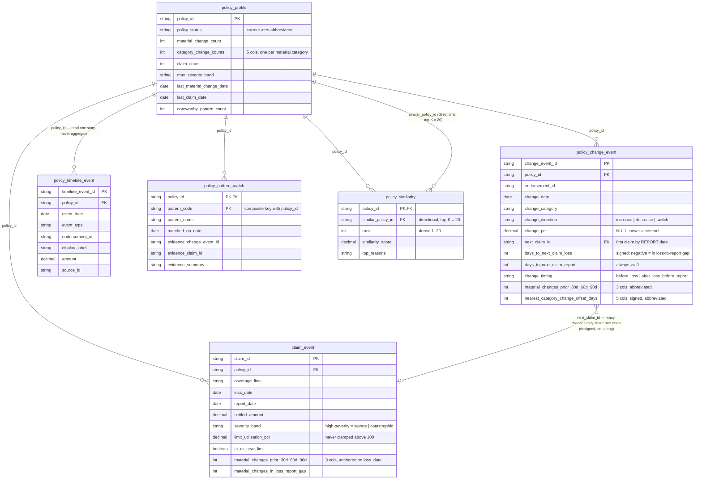

# Semantic Layer Specification

The six curated tables Genie sees, and the expectations that enforce their invariants. They are the gold layer — the `ptm_gold` schema, which is exactly the Genie space (medallion layout, ADR-0016) — built by a Lakeflow Declarative Pipeline from the bronze source tables in `01-data-model-and-synthetic-data.md` via the silver `change_event` stream in `ptm_silver`.

**The SCD Type 2 tables are never exposed to Genie** (ADR-0002).

The space at a glance — attributes abbreviated, full column lists in §2–§7 below (source: [`docs/diagrams/02-er-genie-space.mmd`](../diagrams/02-er-genie-space.mmd)):

---

## 1. The governing principle

Pre-compute temporal **relationships**; leave temporal **thresholds** to Genie.

"Coverage increased within 30 days before a claim" requires a correlated lookahead join from a change to the next claim — the SQL most likely to be silently wrong when generated from natural language. By materialising `days_to_next_claim_loss`, that question collapses to a flat filter, and "within 60 days" is the same query with a different literal. Correctness is tested once in the pipeline instead of re-derived per question.

**Corollary (ADR-0006): pre-compute event-to-event deltas, never event-to-now deltas.** Anything measured against "now" is stale the moment real time passes and will disagree with `CURRENT_DATE` arithmetic by exactly the staleness gap. Recency is expressed by storing *dates*.

---

## 2. `policy_change_event`

**Grain:** one row per field change on a policy, material or otherwise.

### Identity and description
| Column | Type | Notes |
|---|---|---|
| `change_event_id` | string | |
| `policy_id` | string | |
| `customer_id` | string | |
| `endorsement_id` | string | Groups co-committed changes. A column, never a grain (ADR-0003) |
| `change_date` | date | |
| `change_category` | string | `coverage`, `deductible`, `vehicle`, `address`, `status`, `premium`, `agent` |
| `is_material` | boolean | True only for the five material categories (ADR-0003) |
| `coverage_line` | string | NULL for categories that are not line-specific |

### Values
| Column | Type | Notes |
|---|---|---|
| `old_value` | string | Display text |
| `new_value` | string | Display text |
| `old_value_num` | decimal | NULL for categorical categories |
| `new_value_num` | decimal | NULL for categorical categories |
| `change_direction` | string | `increase`, `decrease`, or `switch`. **Always `switch` for categoricals, never NULL** |
| `change_pct` | decimal | NULL for categoricals and when the old value is zero or NULL. **Never a sentinel, never infinity** |

`change_direction` exists so that "coverage increased" is a value filter rather than a string comparison — `'300000' < '100000'` is true lexically, and that is the silent-wrong-answer class this column eliminates.

### Claim linkage (ADR-0004)
| Column | Type | Notes |
|---|---|---|
| `next_claim_id` | string | First claim on the policy **reported** at or after `change_date` |
| `days_to_next_claim_loss` | int | **Signed.** Positive = change preceded the loss; negative = change fell in the Loss-to-Report Gap |
| `days_to_next_claim_report` | int | Always `>= 0` |
| `change_timing` | string | `before_loss` or `after_loss_before_report` |
| `next_claim_amount` | decimal | |
| `next_claim_severity` | string | Same computation as `claim_event.severity_band` |
| `next_claim_coverage_line` | string | |
| `change_relates_to_claimed_coverage` | boolean | `coverage_line = next_claim_coverage_line` (ADR-0005) |

**`next_claim_id` is many-to-one by design.** Three changes preceding one claim all point at it — required for "several material changes before a high-severity claim." Any claim aggregate computed from this table must use `COUNT(DISTINCT next_claim_id)`. This is not a duplication bug.

**All seven linkage columns are NULL together or populated together.** `change_timing` must never default to `before_loss` on an unlinked row, or that filter stops meaning "linked and before the loss."

**Same-day ties:** a change dated the same day as the loss is `before_loss` with a loss delta of 0. A change dated the same day as the report is linked with a report delta of 0.

### Category proximity
| Column | Type |
|---|---|
| `nearest_coverage_change_offset_days` | int |
| `nearest_deductible_change_offset_days` | int |
| `nearest_vehicle_change_offset_days` | int |
| `nearest_address_change_offset_days` | int |
| `nearest_status_change_offset_days` | int |

**Signed:** negative if that category's change came before this row's event, positive if after. Symmetric co-occurrence is `ABS(...) <= N` — one filter, no OR. On a row of the same category, the offset refers to the **previous distinct change of that category**, which is what makes repeat-changer questions work.

### Context
| Column | Type | Notes |
|---|---|---|
| `material_changes_prior_30d` | int | Material changes on the policy in the 30 days before `change_date` |
| `material_changes_prior_60d` | int | |
| `material_changes_prior_90d` | int | |
| `policy_start_date` | date | Denormalised; tenure is derived, never stored |
| `policy_state` | string | Garaging state at the time of the change |

---

## 3. `claim_event`

**Grain:** one row per claim. **This is the table for claim-level counting.**

| Column | Type | Notes |
|---|---|---|
| `claim_id` | string | |
| `policy_id`, `customer_id` | string | |
| `coverage_line` | string | |
| `loss_date`, `report_date` | date | |
| `loss_to_report_days` | int | `>= 0` |
| `settled_amount` | decimal | |
| `severity_band` | string | `minor` `[0,2500)`, `moderate` `[2500,10000)`, `severe` `[10000,50000)`, `catastrophic` `[50000,∞)` |
| `applicable_limit` | decimal | Limit on `coverage_line` at the loss date |
| `limit_utilization_pct` | decimal | NULL when the limit is NULL or zero. **Values above 100% are permitted and never clamped** |
| `at_or_near_limit` | boolean | `limit_utilization_pct >= 90` |
| `claim_status` | string | |

### Prior-change context — **all anchored on `loss_date`**
| Column | Type |
|---|---|
| `material_changes_prior_30d` | int |
| `material_changes_prior_60d` | int |
| `material_changes_prior_90d` | int |
| `material_changes_in_loss_report_gap` | int |
| `days_since_last_material_change_before_loss` | int |
| `last_material_change_category` | string |
| `last_material_change_date` | date |
| `relevant_coverage_change_prior_60d` | boolean |

`material_changes_in_loss_report_gap` exists so gap questions are answerable at claim grain rather than only from the change table (ADR-0004).

---

## 4. `policy_profile`

**Grain:** one row per policy.

### Current state
`policy_id`, `customer_id`, `policy_status`, `policy_start_date`, `term_start_date`, `term_end_date`, `current_city`, `current_state`, `current_annual_premium`, `current_primary_vehicle`, `current_coll_limit`, `current_comp_limit`, `current_bi_limit`, `current_coll_deductible`, `current_comp_deductible`

### Behavioural summary
`material_change_count`, `material_changes_per_year`, `peak_material_changes_30d`, `coverage_change_count`, `deductible_change_count`, `vehicle_change_count`, `address_change_count`, `status_change_count`, `net_coverage_direction`, `claim_count`, `claims_per_year`, `max_severity_band`, `mean_limit_utilization`, `share_material_changes_within_60d_before_loss`

### Recency — dates only
`last_material_change_date`, `last_claim_date`

**Never a day-count.** An event-to-now delta computed at generation time is anchored to `anchor_date` and silently disagrees with `CURRENT_DATE` arithmetic by the staleness gap. "Recent" is computed at query time from these dates, defaulting to 90 days.

### Pattern flags (ADR-0009)
`noteworthy_pattern_count`, `pattern_coverage_raised_then_claimed_same_line`, `pattern_deductible_lowered_before_claim`, `pattern_change_in_loss_report_gap`, `pattern_rapid_change_cluster`, `pattern_vehicle_and_address_within_60d`, `pattern_claim_near_new_limit`

`noteworthy_pattern_count` is the general-purpose summary, so "policies with nothing noteworthy" is `= 0` rather than a six-way `AND NOT` that Genie will eventually get wrong by one term. Adding a rule adds a boolean and changes no existing question.

---

## 5. `policy_timeline_event`

**Grain:** one row per dated thing that happened to a policy.

**For reading one policy's story. Never for counting** — it mixes grains, so aggregates over it are wrong.

| Column | Type | Notes |
|---|---|---|
| `timeline_event_id` | string | |
| `policy_id` | string | |
| `event_date` | date | |
| `event_type` | string | `policy_created`, `policy_change`, `claim_filed`, `claim_payment`, `renewal`, `status_change` |
| `event_category` | string | Change category for change events, else NULL |
| `endorsement_id` | string | Lets the UI group co-committed changes into one card with N deltas |
| `coverage_line` | string | |
| `old_value`, `new_value` | string | |
| `display_label` | string | Pre-rendered, e.g. "Collision limit increased" |
| `amount` | decimal | Claim or payment amount |
| `is_material` | boolean | |
| `source_id` | string | `change_event_id` or `claim_id` |

This is the table the app's deterministic timeline query reads (ADR-0007).

---

## 6. `policy_pattern_match`

**Grain:** one row per policy × matched pattern.

`policy_id`, `pattern_code`, `pattern_name`, `matched_on_date`, `evidence_change_event_id`, `evidence_claim_id`, `evidence_summary`

Rules and their definitions are in ADR-0009. Both this table and the `policy_profile` booleans derive from **one rule evaluation in a single pass** — evaluate each rule once, emit the match rows, derive the booleans and the count from those rows. Never from a second copy of the predicate: ADR-0007 puts the generated SQL in the evidence panel, so a disagreement is visible on screen.

Pattern windows are baked, a deliberate exception to §1. A named definition is not a user-supplied threshold; "rapid change cluster" means something specific or it means nothing.

---

## 7. `policy_similarity`

**Grain:** one row per policy × neighbour, K = 20.

`policy_id`, `similar_policy_id`, `rank`, `similarity_score`, `top_reasons`

- Exact brute-force distance, computed in Spark. Not approximate nearest neighbour: demo reproducibility depends on identical top-K ordering across regenerations, and ANN gives no such guarantee under ties (ADR-0010).
- Ordered by `similarity_score DESC`, then `similar_policy_id ASC`. Without the tie-break, regeneration reorders equal-scoring neighbours.
- A policy is never its own neighbour.
- **Directional.** A appearing in B's top 20 does not imply the reverse. Not a bug; do not symmetrise.
- `similarity_score` is unitless and dataset-relative — comparable within a generation, not across seeds. `rank` is dense, 1..20.
- `top_reasons` is generated at pipeline time from named feature dimensions, under the approved vocabulary.

Feature vector and distance are specified in ADR-0010.

---

## 8. Expectations catalogue

Every invariant is enforced at write time as a pipeline expectation (ADR-0013). A rule recorded only in a document drifts; enforced, it is both a guardrail for the coding agent and a judging artifact.

| # | Expectation | Table | ADR |
|---|---|---|---|
| E1 | `change_pct` is never a sentinel or infinite; NULL instead | `policy_change_event` | 0003 |
| E2 | `change_direction = 'switch'` for every categorical change, never NULL | `policy_change_event` | 0003 |
| E3 | `old_value_num`/`new_value_num` NULL exactly for categorical categories | `policy_change_event` | 0003 |
| E4 | All seven linkage columns NULL together or populated together | `policy_change_event` | 0004 |
| E5 | `change_timing ∈ {before_loss, after_loss_before_report}` on every linked row | `policy_change_event` | 0004 |
| E6 | `days_to_next_claim_report >= 0` always | `policy_change_event` | 0004 |
| E7 | Sign of `days_to_next_claim_loss` agrees with `change_timing` | `policy_change_event` | 0004 |
| E8 | `next_claim_severity` equals `severity_band` for the same `claim_id` | both event tables | 0008 |
| E9 | Severity bands partition the amount range with no overlap and no gap | `claim_event` | 0008 |
| E10 | `limit_utilization_pct` NULL when limit is NULL or zero; never clamped above 100 | `claim_event` | 0008 |
| E11 | `report_date >= loss_date` | `claim_event` | 0004 |
| E12 | Deductible rows exist only for `COLL` and `COMP` | `policy_change_event` | 0005 |
| E13 | `noteworthy_pattern_count` equals `COUNT(DISTINCT pattern_code)` in `policy_pattern_match` | `policy_profile` | 0009 |
| E14 | Each pattern boolean is true iff a matching row exists | `policy_profile` | 0009 |
| E15 | `policy_similarity` excludes self-neighbours | `policy_similarity` | 0010 |
| E16 | `rank` is dense 1..20 per policy, ordered by the documented tie-break | `policy_similarity` | 0010 |
| E17 | No event date exceeds `anchor_date` | all event tables | 0006 |
| E18 | No `pattern_name`, `top_reasons` or `display_label` contains a term outside the approved vocabulary | all | 0009, 0014 |
| E19 | No identifier other than a policy id matches `\bP-\d{5}\b` | all | 0007 |
| E20 | No column stores an event-to-now delta | all | 0006 |

E18 is the product's no-fraud-labelling boundary enforced as a data-quality constraint. E20 is enforced by review against this specification, since it is a property of the schema rather than of a row.

---

## 9. Unity Catalog comments

Genie reads table and column comments as context, so **comments are semantic-layer content, not documentation** (ADR-0013). They are authored here, versioned with this specification, and reviewed like the Genie instruction set. Comments and instructions render from a single authored source and must never be able to disagree.

The counterintuitive definitions must appear verbatim in the relevant column comments:

- `next_claim_id` — "The first claim on this policy **reported** at or after this change. Not the next claim by loss date. Many changes may share one claim."
- `days_to_next_claim_loss` — "Signed. Positive: the change preceded the loss. Negative: the change fell between the loss and its report. Filter with `change_timing`, not with the sign."
- `change_timing` — "Deliberately redundant with the sign of `days_to_next_claim_loss`. Use this rather than interpreting the sign."
- `severity_band` — "High-severity means `severe` or `catastrophic`."
- `policy_timeline_event` (table) — "For reading one policy's history. Do not aggregate; this table mixes grains."
