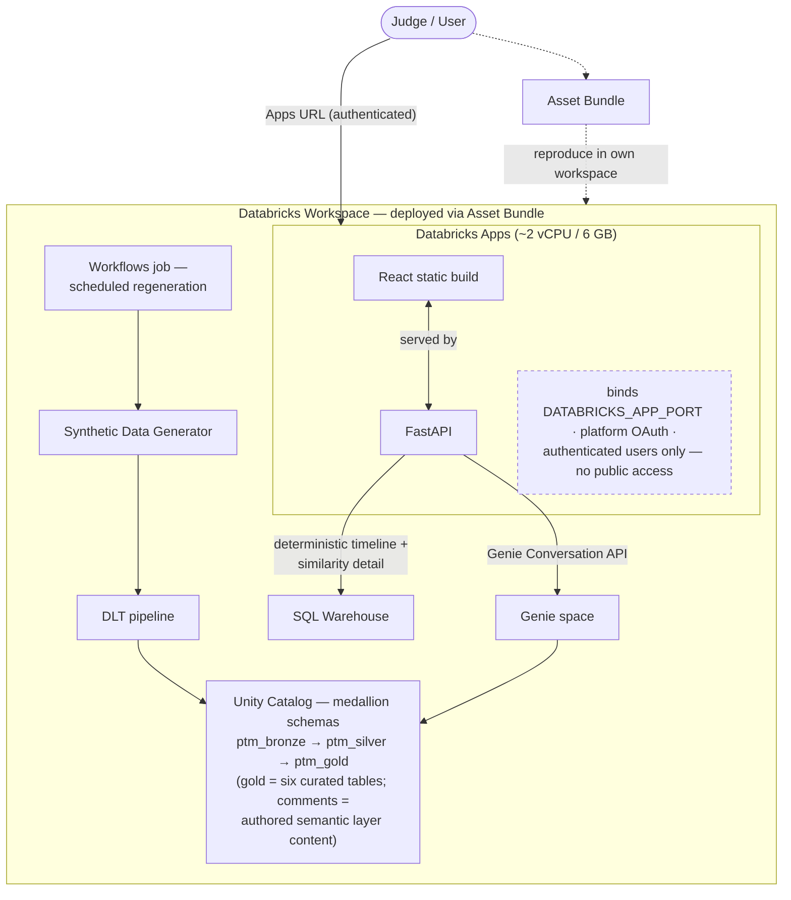

# Implementation Plan

Sequenced by dependency and effort. **Absolute dates are deliberately absent** — the submission deadline has not been supplied. Once it is, §6 converts this into a schedule and fixes the cut line.

---

## 1. Task zero: deploy-envelope smoke test

**Before any product code.** A hello-world FastAPI app serving a built React bundle, deployed through the Databricks Asset Bundle into Databricks Apps.

Not because feasibility is in doubt — Node.js and hybrid frontend/backend apps are supported — but because it validates the build pipeline, `DATABRICKS_APP_PORT` binding, the 10 MB per-file limit and bundle wiring before any UI investment, and it produces the deployment skeleton everything else lands in (ADR-0012).

Exit criteria: the bundle deploys, the app serves a page, and an authenticated `/api/health` round-trips.

---

## 2. Two tracks, largely parallel

The data track is fully specified and blocks nothing. The app track blocks on task zero only.

```
Task zero ──┬── Data track: P1 → P2 → P3 → P4
            └── App track:  P5 → P6
                              ↓
                      P7 (integration) → P8 → P9
```

---

## 3. Data track

### P1 — Generator and bronze source tables (`ptm_bronze`)
Build from `01-data-model-and-synthetic-data.md`. Seeded, anchor-parameterised, emitting the SCD Type 2 history, claims, vehicles, customers and agents.

Non-negotiables: identifier lexical reservation; no absolute dates; the loss-to-report lag distribution; derived premium changes marked non-material; no renewal-driven status recalculations; the six scenarios and five control populations at relative offsets.

Exit criteria: regenerating with the same seed and a different anchor yields identical stories at shifted dates.

### P2 — Declarative pipeline and the four core tables
`policy_change_event`, `claim_event`, `policy_profile`, `policy_timeline_event`, with expectations E1–E12 and E17 live from the first run.

Highest-risk work in the project: the signed loss delta, the seven-column NULL propagation, and the signed category offsets. Build these test-first — the expectations *are* the tests.

Exit criteria: pipeline green with all expectations enforced, not merely defined.

### P3 — Patterns and similarity
`policy_pattern_match` plus the `policy_profile` flags, from a single rule evaluation pass. Then the feature vector, exact distance, and `policy_similarity` at K=20 with the documented tie-break. Expectations E13–E16.

Exit criteria: scenario policies are each other's neighbours at the ranks the demo script expects.

### P4 — Genie space
Unity Catalog comments authored and applied, instructions and the example SQL library loaded from `03-genie-knowledge.md`, rendered from the single authored source.

Exit criteria: all fourteen example questions answered correctly by hand, with the critical two-filter instruction verified specifically.

---

## 4. App track

### P5 — Backend
FastAPI. Genie Conversation API proxy — `start-conversation`, `create-message`, poll, return SQL plus results plus description. The deterministic timeline query. The similarity and pattern reads. Chip bank served from configuration.

The timeline endpoint must be independent of Genie entirely: it renders whether Genie succeeds, times out, or misbehaves (ADR-0007).

### P6 — Frontend
In priority order, because this is where time is lost:

1. **Timeline** — the signature visual. Endorsement grouping into single cards with N deltas. Claims and changes on one axis.
2. **Investigation bar** with policy-ID detection (`\bP-\d{5}\b`, one match opens, several suppress, unknown ID gets an explicit not-found state).
3. **Breadcrumb trail** — cached view restore, never re-query, never grows the thread.
4. **Evidence panel** — generated SQL, row count, Genie's description, per trail node.
5. **Chips** — six contexts, three to five each.
6. **Generic result renderer** — clean table plus auto-chart. Never an error state.
7. **New investigation** control, always visible, auto-offered after any error or empty result.

---

## 5. Integration and delivery

### P7 — CI checks
Three, all of which make claims into tested properties:

- Every chip executes against the generated dataset and returns a non-empty, correctly shaped result. Empty is a build failure.
- Measured effect sizes fall within ±15% of the declared parameters, and the category ranking matches the declared ordering exactly.
- Every diagram in `docs/diagrams/*.mmd` renders with mermaid-cli, and its source appears verbatim in a spec document (`ci/render-diagrams.sh`, run by `.github/workflows/render-diagrams.yml`). A diagram that fails to render, or that drifts from its embedded copy, fails the build.

### P8 — Workflow, bundle, scheduling
Generator → pipeline → patterns and similarity → freshness check, on a schedule sized to the staleness budget. Asset Bundle packages job, pipeline, Genie space and app as one deployable unit — load-bearing, since Databricks Apps has no public access and "reproduce it in your own workspace" is the primary judging path.

What deploys, and how a judge reproduces it (source: [`docs/diagrams/04-deployment.mmd`](../diagrams/04-deployment.mmd)):



### P9 — Demo
Script written in relative language. Must include one typed pronoun or fragment follow-up resolving in-thread — the single moment that proves multi-turn Genie context. Forward-only chains, so the breadcrumb/thread divergence never appears on stage. Recorded, because a public URL may not exist.

---

## 6. Cut order

If time compresses, cut from the bottom. Fixed now, in the calm, rather than at 2 a.m.

**Cut first**
1. Vector Search demonstration — already off the critical path
2. Chip banks for `aggregate_view` and `pattern_view` (keep `investigation_start`, `timeline_open`, `similarity_view`, `cohort_on_screen`)
3. Pattern rules 5 and 6, keeping the four that carry the demo
4. `claim_payment` events on the timeline

**Cut only under real pressure**
5. `policy_similarity` and MVP capability 4 — costs a headline capability but breaks nothing else
6. Auto-chart in the generic renderer, leaving the table

**Never cut**
- The timeline, and its independence from Genie
- The two-filter critical instruction and expectations E4–E7
- Control populations and the approved-vocabulary enforcement
- The disclosure sentence

---

## 7. Remaining specification documents

Writable now from the ADRs; none blocks the build.

| Document | Blocks |
|---|---|
| Query contracts — the fourteen questions with expected shape and acceptance criteria | P4, P7 |
| UX specification — screens, states, empty/loading/error | P6 |
| Demo specification — beat-by-beat script | P9 |
| Test strategy — beyond the two CI checks | P7 |
| Product charter, personas, journeys | nothing; narrative for the writeup |

---

## 8. Open parameters

- **Submission deadline.** Converts this into a schedule and fixes where the cut line falls.
- **Dataset volumes.** Currently the assumption stated in `01-data-model-and-synthetic-data.md` §4.
- ~~**Target workspace, catalog and schema names.**~~ Resolved: catalog `workspace`, medallion schemas `ptm_bronze` / `ptm_silver` / `ptm_gold` (ADR-0016).
- **Warehouse size** — anything serverless will do at this data volume.
