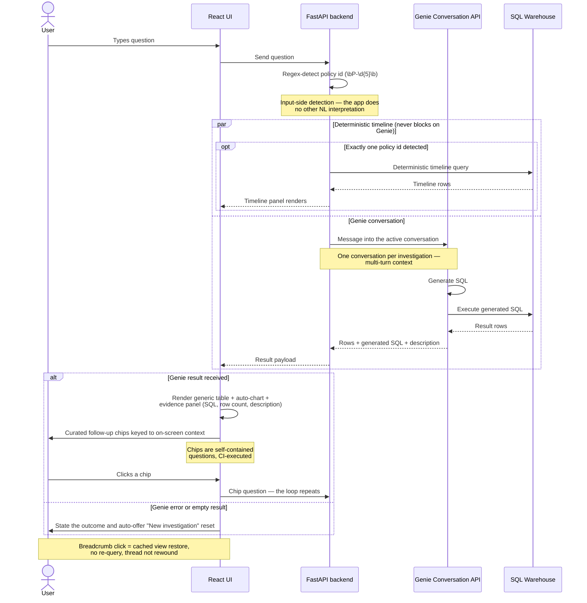

# UX Specification

One screen, three regions, nothing else. The risk from here is addition, not omission — §6 is as binding as the rest.

---

## 1. Layout

```
  Ask about policy history...                      [New]
  Coverage up before claims > P-18492 > Similar
  ------------------------+-------------------------------
  TIMELINE   P-18492      | RESULT              47 rows
                          |
  o Jan 04  Address       | policy     dd     amount
  |         PHX > Scotts  | P-18492    14     24,700
  o Jan 19  COLL limit up | P-20114     9     61,200
  |         100k > 300k   | P-11907    22      8,400
  o Jan 27  Vehicle       |
  |         Accord > MY   | > Evidence: 47 rows, view query
  * Feb 02  CLAIM 24,700  | -------------------------------
            severe        | Find similar policies
                          | Which had a claim near the limit?
```

Fixed split, roughly 40/60. Not resizable, not draggable.

### Region 1 — Top bar
Investigation input and breadcrumb trail on one line, plus a single **New investigation** control. **The breadcrumb is the navigation.** No sidebar, no menu, no header chrome.

### Region 2 — Left panel: the timeline
The signature visual, and the only component that earns custom design effort.

- Vertical spine with dated event cards.
- Changes sharing an `endorsement_id` render as **one card with N deltas** — the payoff for carrying that column (ADR-0003).
- Claims are visually distinct and carry the screen's only strong accent.
- Pattern-matched events carry a small marker whose tooltip names the pattern in approved vocabulary.

### Region 3 — Right panel: the result
Table plus auto-chart, then the evidence drawer, then the chips.

The **evidence drawer** is collapsed by default, showing a one-line summary — *"47 rows · view query"*. Expanded it shows the generated SQL, the row count and Genie's description. Collapsed it keeps the screen calm; expanded it is the judge moment.

**Chips** sit beneath the result, three to five from the context bank, and carry the only call-to-action styling on the screen.

---

## 2. Panel behaviour

| Situation | Behaviour |
|---|---|
| No policy id in the question | Right panel goes full width. **The split exists only when there is a timeline to show — never an empty left panel** |
| One policy id detected | Left panel opens or switches to that policy's deterministic timeline |
| Several policy ids | No timeline opens; right panel full width (ADR-0007) |
| Unknown policy id | Explicit "no policy P-18499 found" state. **Never an empty timeline** — a blank timeline reads as the product breaking |
| Policy row clicked in the result | That policy's timeline loads on the left |

The two panels are the investigation loop drawn as geometry: ask on the right, history on the left, click across to move.

The same loop in sequence (source: [`docs/diagrams/03-investigation-loop.mmd`](../diagrams/03-investigation-loop.mmd)):



---

## 3. States

**Loading.** Skeleton shimmer on the result panel while Genie runs. **The timeline renders immediately and never shows a spinner tied to Genie** (ADR-0007) — it comes from the app's own query and must not inherit Genie's latency or its failures.

**Empty result.** A plain statement of what was asked and that nothing matched, plus the New investigation control auto-offered (ADR-0011). Never a bare empty table.

**Genie error or timeout.** The result panel states the failure; the timeline, if open, stays open and usable. New investigation auto-offered.

**Clarification loop.** If Genie asks for clarification, show its question and auto-offer New investigation — a thread that is going in circles is a poisoned thread.

---

## 4. Visual language

Constraints, not vibes.

- One typeface, two weights.
- 8px spacing grid.
- Near-monochrome palette with **exactly two accents**: one for claims and severity on the timeline, one interactive colour for chips and links.
- No shadow deeper than one level, no gradients, no icon noise. The timeline's typography and spacing carry the polish.
- **Charts inherit the same palette.** The auto-chart must not introduce a rainbow default.

---

## 5. Copy rules

All user-facing text obeys the approved vocabulary in `03-genie-knowledge.md` §7. Noteworthy and associational; never accusatory, never causal.

Rates never appear without their comparison group (ADR-0014). Pattern tooltips name the rule and its definition rather than implying a judgement.

---

## 6. Out of scope for MVP

Written down so the work is never started.

- No dashboard or KPI landing page. The app opens on the input bar with three starter chips and nothing else.
- No dark-mode toggle, no settings, no user preferences.
- No resizable or draggable panels.
- No saved investigations, no export.
- **No investigation notes.** A fourth region, a persistence question and a keyboard-shortcut system for a feature no demo beat uses. The breadcrumb trail already tells the investigation's story.
- **Desktop only, single viewport.** No responsive work. Judges do not grade the phone breakpoint.

---

## 7. Component inventory

Four components in the React app (ADR-0012).

| Component | Effort |
|---|---|
| `TopBar` + `Trail` | Near-stock |
| `Timeline` | **Custom. This is why React was chosen over Streamlit; the polish budget is spent here** |
| `ResultPanel` + `EvidenceDrawer` | Near-stock |
| `ChipRow` | Near-stock |
