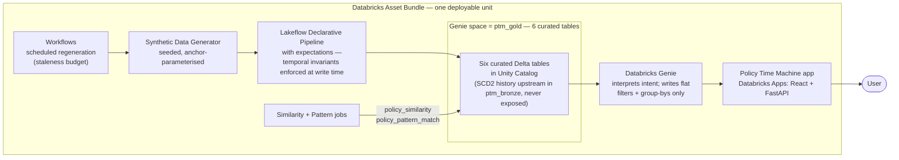

# Product Charter

*Ask what changed, when it changed, and what happened next.*

---

## 1. The problem

Insurance systems preserve years of policy history and almost never use it. A policy accumulates coverage changes, deductible changes, vehicle swaps, address moves and status flips across its life, and every one of those versions is retained — but the analytical surface built on top of it answers only one question: *what does this policy look like now?*

The moment someone asks how it got there, the work changes character. "What changed before this claim?" sounds trivial and requires joining SCD Type 2 versions on effective-date intervals, sequencing events across two grains, and writing a correlated lookahead from a change to the claim that followed it. That is a specialist's query. So the question gets asked of an engineer, or it gets asked in a meeting, or it doesn't get asked.

The history is there. It is simply out of reach of the people whose job it is to understand it.

## 2. Thesis

A dashboard answers *what does this policy look like now*. Policy Time Machine answers *how did this policy get here*.

The product makes historical insurance data explorable rather than archival, by putting Databricks Genie in front of a curated temporal semantic layer. Genie interprets what the user means. The semantic layer supplies temporal relationships that are computed once and verified, not re-derived per question. The application turns the results into an investigation — a timeline, a cohort, evidence, and a next question.

The differentiator is not natural-language SQL. It is that the temporal concepts a user reasons with — *before the claim*, *within thirty days*, *the loss-to-report gap*, *a rapid change cluster* — exist as first-class, defined, enforced things rather than as SQL a language model has to reinvent each time.

The whole system, in one line (source: [`docs/diagrams/01-high-level.mmd`](../diagrams/01-high-level.mmd)):

## 3. Who it is for

An insurance operations, claims or analytics professional who understands policies and claims, and should not need to understand SCD Type 2, effective dates or window functions.

> When reviewing a policy or a claim, I want to see the material changes that happened before and around it, so I can decide whether it warrants a closer look.

## 4. What it does

Four investigations, and no more.

1. **Individual policy history** — the chronological story of one policy, changes and claims on one spine.
2. **Change-before-claim** — finding relationships between material changes and the claims that followed them, at any window the user names.
3. **Portfolio patterns** — which kinds of change most often precede severe claims, and how populations compare.
4. **Similar histories** — policies whose *behaviour* resembles this one's, not whose demographics do.

## 5. What it is not

Not a fraud detection engine. Not a fraud score. Not underwriting, pricing or adjudication. Not a general insurance dashboard, not a general SQL chatbot, not a policy administration system.

This boundary is enforced, not merely stated. A fixed vocabulary governs every user-facing string the system can produce — Genie's answers, pattern names, similarity explanations, timeline labels, interface copy — and it is checked as a data-quality expectation in the pipeline (`02-semantic-layer.md` E18). The product surfaces patterns and names the rule that fired. It never characterises a person.

The second half of that boundary is about causation rather than accusation. The dataset is synthetic and its patterns are deliberately seeded, so the product may describe associations and must never imply prediction. The framing sentence is fixed and used everywhere:

> The dataset is synthetic. Investigation-worthy patterns are deliberately seeded at declared, documented effect sizes — the product demonstrates how historical patterns are surfaced and investigated, not that policy changes predict claims.

## 6. Scope

Personal auto only, with coverage modelled as named lines — bodily injury, property damage, collision, comprehensive, uninsured motorist — each with its own limit and, where applicable, its own deductible.

Depth over breadth was deliberate (ADR-0005). A scalar policy-level coverage amount would make the flagship question weak: a liability-limit increase followed by a windshield claim would satisfy "coverage increased before a claim" exactly as well as a collision-limit increase followed by a collision claim. Coverage lines make the difference computable, and *raised the limit on the very line later claimed against* is a finding rather than a coincidence.

## 7. What makes it work

**A curated temporal layer, not raw history.** Genie sees six flat tables and never the SCD Type 2 history. Temporal *relationships* are pre-computed as columns; temporal *thresholds* stay with Genie as filter literals. "Within 30 days" becomes `days_to_next_claim_loss <= 30` — the SQL Genie is reliable at — while the lookahead join is computed once in a pipeline and tested (ADR-0002).

**Definitions instead of judgement.** Material change, high-severity, recent, similar, noteworthy — each has one deterministic definition, written down, enforced, and stated to Genie verbatim. Nothing important is left to improvisation.

**Invariants enforced at write time.** Twenty pipeline expectations encode the subtle rules: signed deltas agreeing with their categorical, linkage columns nulling together, severity bands partitioning cleanly, no sentinel values anywhere. A rule that lives only in a document drifts (ADR-0013).

**Ground truth for a nondeterministic layer.** The synthetic scenarios double as a test oracle. We know which forty policies were built to match "coverage increased within 30 days before a claim," so the contract asserts on the result rather than on the SQL — robust to rephrasing, fatal to a wrong cohort (ADR-0015).

## 8. Success criteria

1. All fifteen query contracts pass three runs of three.
2. The four capabilities are each reachable by typing a question, not by finding a menu.
3. The timeline renders even when Genie fails.
4. Comparison outputs always show both groups with sample sizes.
5. No user-facing string outside the approved vocabulary survives the pipeline.
6. A judge can deploy the Asset Bundle into their own workspace and reproduce the demo.

## 9. The story

> Insurance systems preserve years of policy history, but that history is hard to explore — "what changed before this claim?" requires temporal SQL across policy versions and claims. Policy Time Machine uses Databricks Genie to turn natural-language questions into historical investigations. A curated temporal semantic layer supplies reliable change and event relationships; the application turns Genie's results into timelines, cohorts, comparisons and evidence. Instead of asking analysts to learn the database, it lets them investigate the history.
