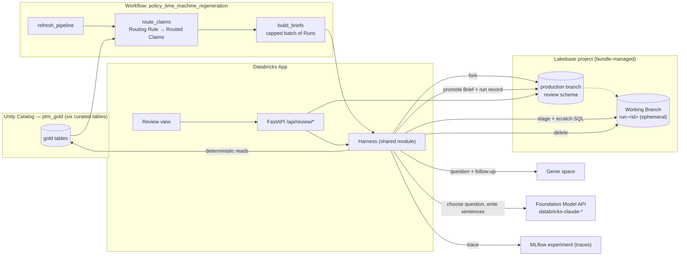

# Claim Review Brief Agent — Design

Date: 2026-09-17
Status: approved (grill-with-docs session, 2026-09-17)
Target: a live 15–20 minute technical meetup demo showcasing lakehouse + Genie + Lakebase + Databricks Apps end to end. The contest six-minute script (`docs/specs/07-demo-specification.md`) is untouched.

Vocabulary is `CONTEXT.md` (§ Review). Decisions with their alternatives are ADR-0017, ADR-0018, ADR-0019. This document states *what* gets built.

## 1. Problem

The product answers questions a person types. Nothing in it works when nobody is at the keyboard, and nothing it produces outlives a browser tab: tabs and trails live in localStorage, the investigation-to-Genie-conversation map is an in-memory dict that forgets on restart. The meetup needs a second act: an agent that does the standard four-step review for a Routed Claim, a durable review record, and a visible harness that keeps the agent inside the charter boundary (no scores, no characterisation of a person, every claim traceable to a named rule).

## 2. What gets built

1. **Routing.** A Routing Rule (High-Severity Claim whose Report Date is Recent, i.e. within 90 days of the dataset anchor) evaluated by a new Workflow task after every regeneration, plus an on-demand path from the app's timeline. Both produce Routed Claims in Lakebase.
2. **The agent and its harness.** One Run per Routed Claim builds a Brief of four sections plus a blank Disposition. The harness executes a fixed plan; the model chooses the Genie question and writes one validated sentence per section (ADR-0018).
3. **Lakebase.** The review record on the production branch; a disposable Working Branch per Run used as the agent's working memory (ADR-0017); the investigation-to-conversation map moves here too.
4. **The Review view.** A separate view in the app: queue, Brief beside the timeline, live Run panel, Disposition control, "Prepare a Brief" on the timeline's claim card, "Open as investigation" per Brief section.
5. **Tests.** Harness tests with fake tools and a fake model; a live branch-lifecycle smoke test; one live Brief contract on the demo policy, run alongside the fifteen Genie contracts.
6. **Meetup demo spec.** `docs/specs/13-meetup-demo-specification.md`, product first then four platform chapters.

## 3. Architecture



Identity: the harness always runs as the app identity (app service principal in the app, run-as user in the Workflow). Viewers never touch Lakebase (ADR-0019). Genie and warehouse calls inside a Run are app identity too, so the nightly and on-demand paths behave identically.

## 4. Routing

**Rule text (shown in the UI verbatim):** "High-severity claim reported in the last 90 days."

**SQL (warehouse, app identity):**

```sql
SELECT c.claim_id, c.policy_id, c.coverage_line, c.loss_date, c.report_date,
       c.settled_amount, c.severity_band, m.anchor_date
FROM workspace.ptm_gold.claim_event c
CROSS JOIN (SELECT anchor_date FROM workspace.ptm_bronze.generation_manifest LIMIT 1) m
WHERE c.severity_band IN ('severe', 'catastrophic')
  AND c.report_date >= date_sub(m.anchor_date, 90)
```

Recent is measured from the dataset anchor, not wall-clock, so the rule is stable between regenerations (ADR-0006). Claim ids are seed-owned, so a Routed Claim is the same claim every night; routing is an upsert keyed on `claim_id`. Claims that fall out of the window are not deleted; their Briefs and Dispositions stay on the record.

On demand: `POST /api/review/claims/{claim_id}/brief` upserts the same row with `routed_by = 'on_demand'` and starts a Run immediately.

## 5. The Brief

A Brief is a JSON document with exactly four sections and a fixed envelope. Stored as one row; rendered by the app.

```json
{
  "claim_id": "C-12345678",
  "policy_id": "P-10155",
  "anchor_date": "2026-09-17",
  "built_at": "2026-09-17T09:12:44Z",
  "run_id": "run-01J...",
  "trace_id": "tr-...",
  "sections": {
    "sequence": {
      "title": "The sequence",
      "rows": [ { "event_date": "...", "event_type": "policy_change", "...": "..." } ],
      "material_change_count": 3,
      "derived_change_count": 2,
      "sql": "SELECT ... FROM policy_timeline_event WHERE ...",
      "row_count": 9,
      "sentence": "Three material changes occurred before the loss, the last one nineteen days before it.",
      "sentence_dropped": false
    },
    "relevant_changes": {
      "title": "The relevant changes",
      "rows": [ { "change_event_id": "...", "change_category": "coverage", "coverage_line": "COLL", "change_timing": "before_loss", "days_to_next_claim_loss": 63, "...": "..." } ],
      "patterns": [ { "pattern_code": "...", "pattern_name": "...", "matched_on_date": "..." } ],
      "situation": "relevant_before_loss",
      "sql": "...", "row_count": 1,
      "sentence": "...", "sentence_dropped": false
    },
    "frequency": {
      "title": "How common this is",
      "shape": "relevant_before_loss",
      "question": "How often does a collision limit increase within 63 days before a claim precede a high-severity claim, compared with increases not followed by one?",
      "follow_up": null,
      "columns": ["group", "rate", "n"],
      "rows": [ ["...", "..."] ],
      "sql": "...", "row_count": 2, "genie_status": "ok",
      "sentence": "...", "sentence_dropped": false
    },
    "similar": {
      "title": "Similar histories",
      "rows": [ { "similar_policy_id": "P-20114", "rank": 1, "similarity_score": 0.91, "top_reasons": "..." } ],
      "sql": "...", "row_count": 5,
      "sentence": "...", "sentence_dropped": false
    }
  }
}
```

Rules:

- Sections one, two and four come from deterministic warehouse SQL the harness owns; section three comes from Genie.
- The sequence window is the 365 days ending on the Loss Date, inclusive. Derived Changes are present in `rows` and excluded from `material_change_count`.
- A Relevant Change is a `policy_change_event` row with `next_claim_id = <claim_id>` and `change_relates_to_claimed_coverage = true`.
- `situation` is one of `relevant_in_gap`, `relevant_before_loss`, `pattern_only`, `nothing_before`, detected by the harness (§6.3).
- Every `sentence` passed the vocabulary check, or is `null` with `sentence_dropped: true`.
- No summary, no field that weighs sections against each other.

## 6. The harness

### 6.1 Plan (fixed, ADR-0018)

| Step | Owner | Tool | Writes to |
|---|---|---|---|
| 0 | harness | claim the Routed Claim (conditional update on main) | main |
| 1 | harness | create Working Branch + endpoint, connect | Lakebase API |
| 2 | harness | sequence query → stage `stage_timeline` | branch |
| 3 | harness | relevant changes + pattern matches → stage `stage_relevant_changes`, `stage_patterns`; detect situation | branch |
| 4 | model | choose frequency question for the situation (JSON) | — |
| 4a | harness | validate question against the shape; ask Genie (fresh conversation) | Genie |
| 4b | model | optional one narrowing follow-up (JSON) → Genie, same conversation | Genie |
| 4c | harness | stage Genie rows → `stage_frequency` | branch |
| 5 | harness | similar histories top 5 → stage `stage_similar` | branch |
| 6 | model | one sentence per section, with scratch SQL over the staged tables (JSON loop) | branch (reads) |
| 7 | harness | vocabulary check each sentence; drop on failure | — |
| 8 | harness | promote Brief + run record; mark Routed Claim `brief_ready` | main |
| 9 | harness | demo hold (only if `REVIEW_DEMO_HOLD_SECONDS` > 0); delete endpoint and branch | Lakebase API |

Any exception between steps 1 and 8: run marked `failed` with a short reason, Routed Claim back to `queued`, branch deleted (best effort), nothing promoted.

### 6.2 Budgets

- Genie turns: at most 2 per Run.
- Scratch SQL statements: at most 8 per Run, `SELECT` only, statement timeout 10 s, result capped at 50 rows.
- Model calls: at most 2 + 4 × 3 = 14 per Run (question, follow-up, and up to three turns per sentence).
- Wall clock: 180 s from step 1; exceeded → failed.
- Sentence: one attempt; a vocabulary failure drops the sentence rather than retrying.

### 6.3 Situation detection and the four question shapes

| Situation | Detected when | Question shape the model must produce |
|---|---|---|
| `relevant_in_gap` | any Relevant Change has `change_timing = 'after_loss_before_report'` | How often same-line coverage/deductible changes fall inside the loss-to-report gap versus before the loss, with both groups and their sizes. |
| `relevant_before_loss` | Relevant Changes exist, all `before_loss` | How often a same-line increase within *N* days (N = the observed `days_to_next_claim_loss` of the nearest Relevant Change, rounded up to 30/60/90) precedes a high-severity claim versus increases not followed by one. |
| `pattern_only` | no Relevant Change, at least one pattern match with `evidence_claim_id = <claim_id>` | How common the named pattern is among policies with high-severity claims versus policies without. |
| `nothing_before` | none of the above | What share of high-severity claims had no material change in the prior year, versus claims that did. |

Validation is structural, not string-matching: the model's JSON carries `{"shape": "<situation>", "question": "..."}`; the harness rejects the response if `shape` does not equal the detected situation, if the question lacks the comparison phrasing (`versus`, `compared`, `against`), or if it contains any banned term. Rejected → one retry with the validation reason → still rejected → the harness substitutes the canonical question for that shape (from `questions.py`) so the Run completes. The frequency section records `question_source: "model" | "canonical"`.

### 6.4 Prompts

System prompt (fixed, versioned in `prompts.py`): the glossary definitions of Material Change, Relevant Change, Change Timing, Loss-to-Report Gap, High-Severity Claim, Comparison Group, Noteworthy Pattern; the approved and banned vocabulary; the instruction that every sentence states a fact already present in the staged rows; the JSON contracts for each step. Temperature 0. No tool-calling API is used: every model turn returns one JSON object, so the harness works on any endpoint that returns text.

### 6.5 Scratch SQL

The model may run `SELECT` statements on the branch against `stage_timeline`, `stage_relevant_changes`, `stage_patterns`, `stage_frequency`, `stage_similar`. The harness executes them in a read-only transaction on the branch connection, rejects anything that is not a single `SELECT`, and never runs them on main. The blast radius is the Working Branch, which is deleted at step 9.

### 6.6 Vocabulary check

`review/vocabulary.py` carries the same banned list as `pipeline/transformations.py::BANNED_VOCABULARY`. A local test asserts the two lists are identical when the pipeline package is importable, so they cannot drift silently. A sentence is dropped if any banned term matches as a whole word (case-insensitive) or if it contains a policy id other than the Brief's own, or any word from a short "judgement" list (`should`, `likely`, `intent`, `deliberately`).

## 7. Lakebase

### 7.1 Bundle resources

```yaml
resources:
  postgres_projects:
    ptm_review:
      project_id: policy-time-machine
      display_name: Policy Time Machine review record
      pg_version: 17
      permissions:
        - level: CAN_MANAGE
          service_principal_name: ${var.app_service_principal_id}
  postgres_branches:
    ptm_production:
      parent: ${resources.postgres_projects.ptm_review.id}
      branch_id: production
      replace_existing: true
      no_expiry: true
  postgres_endpoints:
    ptm_primary:
      parent: ${resources.postgres_branches.ptm_production.id}
      endpoint_id: primary
      endpoint_type: ENDPOINT_TYPE_READ_WRITE
      autoscaling_limit_min_cu: 0.5
      autoscaling_limit_max_cu: 1
  postgres_databases:
    ptm_review_db:
      parent: ${resources.postgres_branches.ptm_production.id}
      database_id: review
```

App binding (in the `apps` resource): `resources: [{ name: postgres, postgres: { branch: ..., database: ..., permission: CAN_CONNECT_AND_CREATE } }]`. The platform creates the app SP's Postgres role and injects `PGHOST`, `PGPORT`, `PGDATABASE`, `PGUSER`, `PGSSLMODE`. The app SP also needs CAN MANAGE on the project (branch operations) and CAN RUN on the Genie space.

Free Edition: one project per account; scale-to-zero; non-default branches share a concurrent-compute limit, so Runs are strictly sequential (one Working Branch alive at a time).

### 7.2 Schema (`review` schema on the `review` database)

```sql
CREATE SCHEMA IF NOT EXISTS review;

CREATE TABLE IF NOT EXISTS review.routed_claim (
  claim_id        text PRIMARY KEY,
  policy_id       text NOT NULL,
  coverage_line   text NOT NULL,
  loss_date       date NOT NULL,
  report_date     date NOT NULL,
  settled_amount  numeric NOT NULL,
  severity_band   text NOT NULL,
  routed_by       text NOT NULL,          -- 'rule' | 'on_demand'
  routing_rule    text,                   -- rule text when routed_by = 'rule'
  run_state       text NOT NULL DEFAULT 'queued',  -- queued | in_progress | brief_ready | failed
  active_run_id   text,
  routed_at       timestamptz NOT NULL DEFAULT now(),
  updated_at      timestamptz NOT NULL DEFAULT now()
);

CREATE TABLE IF NOT EXISTS review.run (
  run_id        text PRIMARY KEY,
  claim_id      text NOT NULL REFERENCES review.routed_claim(claim_id),
  status        text NOT NULL,            -- running | completed | failed
  current_step  text,
  step_count    int NOT NULL DEFAULT 0,
  branch_name   text,
  trace_id      text,
  failure       text,
  started_at    timestamptz NOT NULL DEFAULT now(),
  finished_at   timestamptz
);

CREATE TABLE IF NOT EXISTS review.brief (
  claim_id    text PRIMARY KEY REFERENCES review.routed_claim(claim_id),
  run_id      text NOT NULL REFERENCES review.run(run_id),
  anchor_date date NOT NULL,
  built_at    timestamptz NOT NULL DEFAULT now(),
  body        jsonb NOT NULL
);

CREATE TABLE IF NOT EXISTS review.disposition (
  claim_id    text PRIMARY KEY REFERENCES review.routed_claim(claim_id),
  outcome     text NOT NULL,              -- closer_look | nothing_noteworthy | more_information
  note        text,
  recorded_by text NOT NULL,
  recorded_at timestamptz NOT NULL DEFAULT now()
);

CREATE TABLE IF NOT EXISTS review.investigation (
  investigation_id  text PRIMARY KEY,
  conversation_id   text,
  created_at        timestamptz NOT NULL DEFAULT now(),
  updated_at        timestamptz NOT NULL DEFAULT now()
);
```

Migration runs idempotently at app startup and at the start of `route_claims`. Whoever runs it grants the app SP role `USAGE` on the schema, `ALL` on existing tables and default privileges on future ones, so the app can read tables the Workflow's run-as user created. Working Branches inherit schema, data and roles from production at fork time and are never migrated.

Stage tables on the Working Branch (created by the harness per Run, in schema `review`): `stage_timeline`, `stage_relevant_changes`, `stage_patterns`, `stage_frequency`, `stage_similar`, plus `run_step` (the full step log: step, tool, sql, row_count, elapsed_ms, payload jsonb). The step log dies with the branch (ADR-0017).

### 7.3 Branch lifecycle (SDK)

```python
from databricks.sdk.service.postgres import Branch, BranchSpec, Duration, Endpoint, EndpointSpec, EndpointType

branch = client.postgres.create_branch(
    parent=f"projects/{PROJECT}",
    branch=Branch(spec=BranchSpec(source_branch=f"projects/{PROJECT}/branches/{MAIN_BRANCH}",
                                  ttl=Duration(seconds=900))),
    branch_id=f"run-{run_id}",
).wait()
endpoint = client.postgres.create_endpoint(
    parent=branch.name,
    endpoint=Endpoint(spec=EndpointSpec(endpoint_type=EndpointType.ENDPOINT_TYPE_READ_WRITE,
                                        autoscaling_limit_min_cu=0.5, autoscaling_limit_max_cu=1.0)),
    endpoint_id="primary",
).wait()
host = endpoint.status.hosts.host
token = client.postgres.generate_database_credential(endpoint=endpoint.name).token
```

TTL 15 minutes is the platform backstop; the harness deletes explicitly (endpoint, then branch). Requires `databricks-sdk >= 0.89` (the `postgres` service). The bump is a task of its own with the existing test suite as the gate, because `app/backend/genie.py` carries SDK-version fallbacks.

### 7.4 Connections

`psycopg[binary] >= 3.2`. Password is a fresh `generate_database_credential(...).token` per connection (60-minute lifetime). Main: host from `PGHOST` in the app, or `get_endpoint(...).status.hosts.host` in the Workflow; user from `PGUSER` in the app, or `current_user.me().user_name` in the Workflow; `sslmode=require`; database `review`.

## 8. Model and tracing

- Endpoint name is configuration: `REVIEW_MODEL_ENDPOINT`, default `databricks-claude-sonnet-4-5`, to be confirmed against the workspace serving page before first deploy (Free Edition: "certain models not available"). Fallback `databricks-claude-haiku-4-5`.
- Calls go through `WorkspaceClient.serving_endpoints.query(name=..., messages=[ChatMessage(...)], max_tokens=..., temperature=0.0)`; the reply is `response.choices[0].message.content`, parsed as one JSON object (code fences stripped). This is the Databricks Model Serving surface, chosen in the design session over the Anthropic API directly for ecosystem fit; the `claude-api` skill's Anthropic-SDK default therefore does not apply here.
- MLflow tracing: `mlflow.set_tracking_uri("databricks")`, `mlflow.set_experiment(REVIEW_MLFLOW_EXPERIMENT)`; the Run is one `@mlflow.trace(span_type=SpanType.AGENT)` with child spans per tool (`SpanType.TOOL`) and per model call (`SpanType.LLM`). The trace id is read after the root span closes with `mlflow.get_last_active_trace_id()` and stored on the run record. The experiment is a bundle `experiments` resource with CAN_EDIT for the app SP. `mlflow >= 3.1, < 4`.

## 9. App

### 9.1 API (`/api/review/*`, all app identity to Lakebase, ADR-0019)

| Method | Path | Behaviour |
|---|---|---|
| GET | `/api/review/queue` | Routed Claims with run_state, routed_by, routing_rule, Disposition summary; newest report_date first. |
| GET | `/api/review/claims/{claim_id}` | Routed Claim + Brief body (if any) + Disposition + active Run summary. |
| POST | `/api/review/claims/{claim_id}/brief` | Upsert as `on_demand` if unknown (claim looked up on the warehouse as the viewer, so a viewer without access gets `no_access`), then start a Run in a background thread if none is in progress. Returns `{run_id, started: bool}`. |
| GET | `/api/review/runs/{run_id}` | `{status, current_step, step_count, branch_name, trace_id, failure}` for polling. |
| POST | `/api/review/claims/{claim_id}/disposition` | Body `{outcome, note}`; `recorded_by` from the forwarded viewer identity (`x-forwarded-email` header, falling back to `current_user.me()`); 409 if no Brief yet. |

The existing message endpoint persists the investigation-to-conversation map in `review.investigation` when Lakebase is configured, and falls back to the in-memory store otherwise (local dev and tests unchanged).

### 9.2 Review view

- A header toggle switches between **Investigate** (the existing tab strip) and **Review**. The Review view is its own layout: queue list on the left, detail on the right.
- Detail = the existing `Timeline` component for the policy (on-behalf-of, so `no_access` propagates) and a `BriefPanel` with four sections. Each section shows its sentence (or "sentence withheld: vocabulary check"), its rows in the existing table style, and an `EvidenceDrawer` with the SQL and row count. The frequency section also shows the question, the follow-up, and whether the question was model-chosen or canonical.
- If the timeline reports `no_access`, the Brief panel renders the same quiet no-access state (ADR-0019).
- `RunPanel` polls `/api/review/runs/{run_id}` every second while a Run is in progress and narrates: branch created (name), each section, sentences validated, Brief promoted, "branch deleted by the harness". Copy never says the agent cleaned up.
- `DispositionForm`: three fixed outcomes, optional note, shows who and when once recorded.
- "Prepare a Brief" button on the timeline's claim card (prop `onPrepareBrief(claimId)` on `Timeline`) → POST brief → switch to Review with that claim selected.
- "Open as investigation" on each Brief section opens a new investigation tab seeded with that section's question (frequency: the Genie question; others: a chip-style question naming the policy id) and switches to Investigate.
- Queue rows for rule-routed claims show the Routing Rule text; on-demand rows say "requested from the timeline".

## 10. Workflow

Two tasks appended to `policy_time_machine_regeneration` after `refresh_pipeline`:

1. `route_claims` (`workflow/route_claims_task.py`): migrate schema, run the routing SQL on the warehouse, upsert Routed Claims (`routed_by='rule'`), print counts.
2. `build_briefs` (`workflow/build_briefs_task.py`): work the queue — undisposed Routed Claims without a Brief, newest `report_date` first, cap `REVIEW_NIGHTLY_CAP` (default 20) — sequentially through the same harness. Prints one line per Run with outcome and duration.

Both import the harness from the synced `app/backend/review` package via the bundle-root `sys.path` bootstrap the existing tasks use. Job environment adds `databricks-sdk>=0.89`, `psycopg[binary]>=3.2`, `mlflow>=3.1,<4`.

## 11. Testing (spec 08 extended)

- **Unit (pytest, no Databricks):** vocabulary; situation detection; question validation for each shape; harness end-to-end with fake tools, fake model, fake branch lifecycle and an in-memory store — asserting step order, budgets, sentence drop, promotion only on success, branch deletion on both paths, conditional claim; store SQL against a local Postgres if `REVIEW_TEST_PG_DSN` is set, otherwise skipped; API endpoints with the store mocked.
- **Frontend (vitest):** Review view renders queue/detail states; RunPanel narration; Disposition form; Prepare a Brief wiring; no_access mirroring.
- **Live smoke (`ci/review/smoke_branch.py`):** create branch + endpoint, connect, `SELECT 1`, delete both. Fails fast with a clear message if the project is missing or the identity lacks CAN MANAGE.
- **Live contract (`ci/review/run_brief_contract.py`):** build a Brief for the demo policy's latest claim three times; assert sequence rows against `policy_timeline_event`, relevant changes against `policy_change_event`, neighbours against `policy_similarity`, the frequency shape equals the detected situation, every sentence passes vocabulary, and no partial Brief exists on main after a forced failure (one run with an injected Genie error). 3/3, like the Genie contracts.

## 12. Meetup demo (outline; full script is spec 13)

Product first (≈3 min: cohort, timeline, multi-turn, similarity), then four chapters (≈4 min each): the lakehouse and the declarative pipeline with expectations; the Genie space and its curation; the agent Run live with the Lakebase branch console; the governance revoke close. Two minutes for questions. Each chapter has a pre-recorded 30-second fallback clip; one Brief is pre-built before the talk; `REVIEW_DEMO_HOLD_SECONDS=20` during the agent chapter.

## 13. Out of scope

Server-side investigations/tabs; per-viewer Lakebase roles; synced gold tables in Lakebase; multiple concurrent Runs; retries of failed Runs beyond re-queueing; any Brief content that weighs or recommends.

## 14. Verifications before implementation starts

1. `databricks auth login --profile DEFAULT` (refresh token currently invalid).
2. Serving page: which `databricks-claude-*` endpoints are enabled; pin `REVIEW_MODEL_ENDPOINT`.
3. `SELECT COUNT(*)` of the routing rule against gold to size the nightly cap.
4. Bundle deploy of the Lakebase resources on Free Edition (one project per account).
